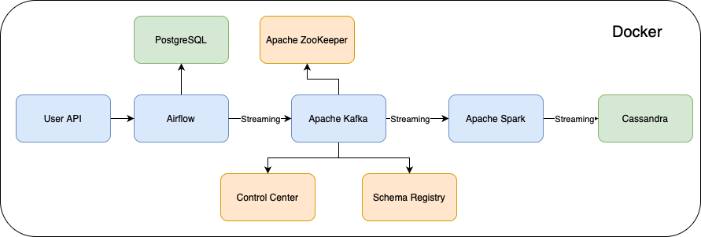

# Real-Time User Streaming Pipeline

The Real-Time User Streaming Pipeline is designed to handle high-velocity data streams, process the data in real-time, and store the results for further analysis. The pipeline architecture consists of:

- **Apache Kafka**: Used for real-time data streaming.
- **Apache Airflow**: Orchestrates the workflow, scheduling tasks to manage the flow of data to Kafka
- **Apache Spark**: Utilized for real-time data processing.
- **Apache Cassandra**: A highly scalable NoSQL database for storing processed data.
- **Docker**: Containerizing entire data engineering setup with Docker

## System Architecture


## Installation

### Prerequisites

- Docker
- Docker Compose
- Python 3.8 or higher

### Steps

1. Clone the repository:

   ```bash
   git clone https://github.com/yourusername/real-time-user-streaming-pipeline.git
   cd real-time-user-streaming-pipeline
   ```
2. Build and start the Docker containers:
  ```bash
  docker-compose up -d
```
3. Install the required Python packages:
   ```bash
   pip install -r requirements.txt
   ```
## Usage
### Running the Pipline

Start the Spark streaming Job:
```bash
python spark_stream.py
```


   
